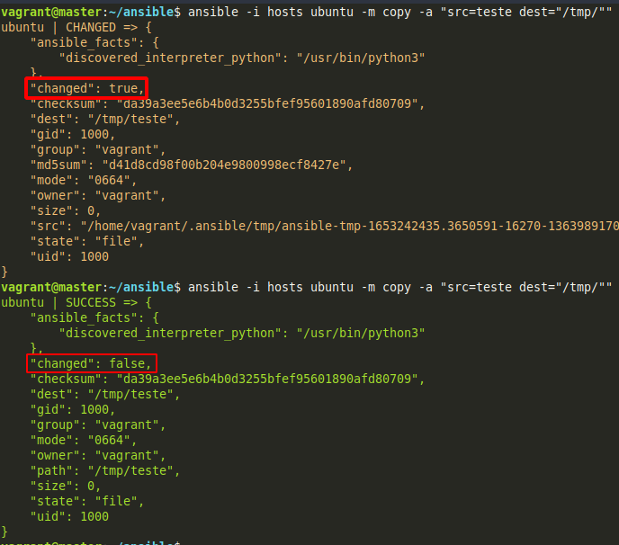
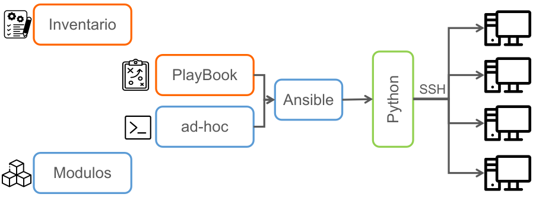

# Estudos sobre Ansible e Vagrant, automação de infraestrutura como código

### Oque é o Ansible

Uma ferramenta de automação e gerenciamento de configurações.  
Cada uma destas ferramentas têm seus prós e contras, dependendo da necessidade. Nenhuma é superior a outra.  

### Porque Ansible?

É livre e de código aberto;  
Curva rápida de aprendizado;  
Automatização em menos tempo;  
Entrega completa em minutos;  
Gerenciamento simples;  
Sem necessidade de agentes (SSH);  
Indempotência: é a propriedade que algumas operações têm de poderem ser aplicadas várias vezes sem que o valor do resultado se altere após a aplicação inicial. Em resumo, será executado apenas se houver necessidade.

### Ferramentas com o mesmo segmento no mercado
 - Ansible  
 - Puppet  
 - Chef  
 - SaltStack  

## Administração do Ansible

## Arquivos

**Inventário**:  Arquivo que descreve as máquinas a serem acessadas pelo Ansible e suas particularidades.

**Modulos**: pequenos programas utilizados para realizar tarefas de automação no nó destino.

**Playbooks**: UM arquivo escrito em linguagem YAML com configuração simples, reutilizável e repetível.

**ad-hoc**: Quando utilizamos o Ansible para uma tarefa única, por exemplo: desligar, reiniciar, enviar um arquivo, inserimos um módulo diretamente da linha de comando. Já para comandos mais complexos, é necessário usar um Ansible Playbook.

## Gerador de gitignore

https://www.toptal.com/developers/gitignore